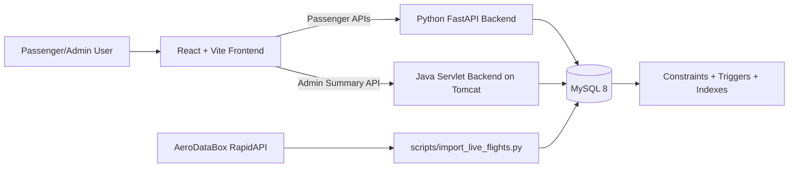

# Airline Reservation System

[](https://www.python.org/)
[](https://fastapi.tiangolo.com/)
[](https://www.oracle.com/java/)
[](https://www.mysql.com/)
[](https://react.dev/)
[](https://vite.dev/)

A dual-backend Airline Reservation System built for academic database design and full-stack implementation.

## Quick Links

- [Overview](#overview)
- [Architecture](#architecture)
- [Feature Highlights](#feature-highlights)
- [Project Structure](#project-structure)
- [Quick Start](#quick-start)
- [API Map](#api-map)
- [Environment Variables](#environment-variables)
- [Live Flight Import](#live-flight-import)
- [Screenshots](#screenshots)
- [Database Normalization](#database-normalization)
- [Phase Report](#phase-report)

## Overview

This project implements an airline reservation platform with a normalized MySQL schema, a FastAPI passenger backend, a Java/Tomcat admin reporting backend, and a React frontend.

Primary capabilities:
- passenger registration and login
- flight search with airport autocomplete
- optional seat lock with surcharge
- booking creation with random seat allotment
- booking retrieval and cancellation with refund logic
- admin dashboard summary reporting
- live flight schedule import from AeroDataBox (RapidAPI)

## Architecture



## Feature Highlights

### Passenger Features
- Register and log in
- Search flights by origin, destination, date, and sort options
- View airport suggestions for faster search input
- Create booking with optional random seat assignment
- Optional seat lock before booking confirmation
- Retrieve booking by PNR and last name
- Cancel booking with refund computation

### Admin Features
- Dashboard summary (bookings, confirmations, revenue, occupancy)
- Booking Explorer in Admin Dashboard with filters (status, flight, passenger, email, limit)
- Admin endpoint split via Java servlet service
- Operational APIs for route, aircraft, and flight maintenance

### Data and Integrity Features
- 3NF-oriented relational design
- Foreign keys, unique keys, and checks for consistency
- Trigger-based rule enforcement (capacity, overlap, seat consistency)
- Seed scripts and live import script for expanding schedule coverage

## Project Structure

```text
backend/                FastAPI app (auth, search, booking, admin ops)
frontend/               React UI (passenger console + admin dashboard route)
admin-java/             Java servlet project (Tomcat WAR for admin summary)
database/               Schema, triggers, and seed SQL scripts
scripts/                Smoke tests + live flight importer
start-all.ps1           One-command local startup script
PHASE_1_REPORT.md       Detailed phase report and normalization analysis
```

## Quick Start

### 1) Initialize Database

```sql
SOURCE database/01_schema.sql;
SOURCE database/02_triggers.sql;
SOURCE database/03_seed.sql;
```

### 2) Configure Backend

Create `backend/.env`:

```env
DB_USER=root
DB_PASSWORD=your_password
DB_HOST=localhost
DB_PORT=3306
DB_NAME=airline_reservation
JWT_SECRET=replace-with-strong-secret
JWT_ALGORITHM=HS256
ACCESS_TOKEN_EXPIRE_MINUTES=60
RAPIDAPI_KEY=your_rapidapi_key
RAPIDAPI_HOST=aerodatabox.p.rapidapi.com
```

### 3) Start Services

Option A: One command (recommended)

```powershell
.\start-all.ps1
```

Option B: Start manually

```powershell
# FastAPI
.\.venv\Scripts\python.exe -m uvicorn backend.app.main:app --reload

# Frontend
cd frontend
npm install
npm run dev

# Java Admin (build/deploy to Tomcat)
cd ..\admin-java
mvn clean package
```

## API Map

| Area | Method | Endpoint | Purpose |
|---|---|---|---|
| Health | GET | `/health` | FastAPI health check |
| Auth | POST | `/auth/register` | Passenger registration |
| Auth | POST | `/auth/login` | JWT login |
| Auth | GET | `/auth/me` | Current user profile |
| Flights | GET | `/airports` | Airport options/autocomplete |
| Flights | GET | `/flights/search` | Flight search by route/date |
| Booking | POST | `/bookings/seat-lock` | Temporary seat hold |
| Booking | POST | `/bookings` | Booking + payment creation |
| Booking | GET | `/bookings/current` | Current user's future bookings (or admin: all) |
| Booking | GET | `/bookings/retrieve` | Retrieve booking details |
| Booking | GET | `/bookings/{pnr}/ticket` | Ticket view |
| Booking | POST | `/bookings/{pnr}/cancel` | Booking cancellation + refund |
| Booking | POST | `/bookings/{pnr}/change-seat` | Change seat on confirmed booking |
| Booking | POST | `/bookings/{pnr}/change-flight` | Rebook to different flight |
| Admin | GET | `/admin/bookings` | List all bookings (admin only) |
| Admin (Java) | GET | `/admin/health` | Tomcat service health |
| Admin (Java) | GET | `/admin/dashboard/summary` | Dashboard metrics |

## Environment Variables

### Backend
- `DB_USER`
- `DB_PASSWORD`
- `DB_HOST`
- `DB_PORT`
- `DB_NAME`
- `JWT_SECRET`
- `JWT_ALGORITHM`
- `ACCESS_TOKEN_EXPIRE_MINUTES`

### Frontend
- `VITE_PASSENGER_API_BASE_URL`
- `VITE_ADMIN_API_BASE_URL`

### Live Import
- `RAPIDAPI_KEY`
- `RAPIDAPI_HOST`

## Live Flight Import

Import schedules for India:

```powershell
.\.venv\Scripts\python.exe scripts\import_live_flights.py --country IN --hours-ahead 24 --max-retries 3 --sleep-ms 2500
```

Import specific airports:

```powershell
.\.venv\Scripts\python.exe scripts\import_live_flights.py --airports DEL,BOM,BLR --hours-ahead 24
```

What the importer does:
- resolves/ensures major Indian airports
- fetches schedules from AeroDataBox
- upserts `airport`, `airline`, `route`, and `flight`
- updates existing flights by `(flight_number, departure_time)`

## Bulk Demo Bookings

When you have many flights and want realistic booking volume without manual booking, run:

```powershell
.\.venv\Scripts\python.exe scripts\seed_bulk_bookings.py --all-flights --bookings-per-flight 4
```

The script by default:
- Creates **200 synthetic passengers** if the passenger table is empty (ensures diverse bookings)
- Processes all eligible future flights
- Distributes bookings across multiple passengers for realism

Useful options:
- `--target-passenger-id 1`: create all generated bookings under one passenger account (useful for Manage Booking demo)
- `--skip-passenger-creation`: disable auto-creation of synthetic passengers
- `--auto-create-passengers 500`: create a custom number of synthetic passengers
- `--dry-run`: preview inserts without writing to database
- `--max-flights 100`: process only first N future flights instead of `--all-flights`

### Admin Booking List API

Admin users can view **all bookings by all passengers** via the `/admin/bookings` endpoint with powerful filtering:

```
GET /admin/bookings
GET /admin/bookings?status=Confirmed
GET /admin/bookings?flight_id=5
GET /admin/bookings?passenger_id=3
GET /admin/bookings?passenger_email=john
GET /admin/bookings?flight_id=5&status=Confirmed
GET /admin/bookings?status=Cancelled&limit=1000
```

**Query Parameters:**
- `status`: Filter by Pending, Confirmed, or Cancelled
- `flight_id`: Show only bookings for a specific flight
- `passenger_id`: Show only bookings by a specific passenger
- `passenger_email`: Search by partial email match
- `limit`: Results per page (default 500, max 5000)

### Admin UI Booking Filters

In the React Admin Dashboard route (`/admin`), the **Booking Explorer** panel exposes the same filters used by the API:

- Status
- Flight ID
- Passenger ID
- Passenger Email (partial match)
- Limit

Use **Apply Filters** to query matching rows and **Clear Filters** to reset back to the default view.

## Screenshots

Add screenshots under `docs/screenshots/` using these file names:

- `docs/screenshots/login.png`
- `docs/screenshots/signup.png`
- `docs/screenshots/search.png`
- `docs/screenshots/booking.png`
- `docs/screenshots/manage-booking.png`
- `docs/screenshots/admin-dashboard.png`

Suggested markdown snippet once images are added:

```md


```

## Database Normalization

The data model is normalized to 3NF with:
- entity separation for airline, airport, route, aircraft, passenger, app user, flight, booking, payment, refund, and seat lock
- key constraints and referential integrity
- trigger-based anomaly prevention and correction for schedule overlap and seat/capacity consistency

## Phase Report

For detailed functional dependencies, anomaly detection/rectification, and design rationale:

- [PHASE_1_REPORT.md](PHASE_1_REPORT.md)

## Notes

- Seeded admin account uses `admin@airline.com` with password `Admin@1234`.
- Seat lock is optional and applies surcharge when used.
- Frontend includes live validation indicators for signup rules.
